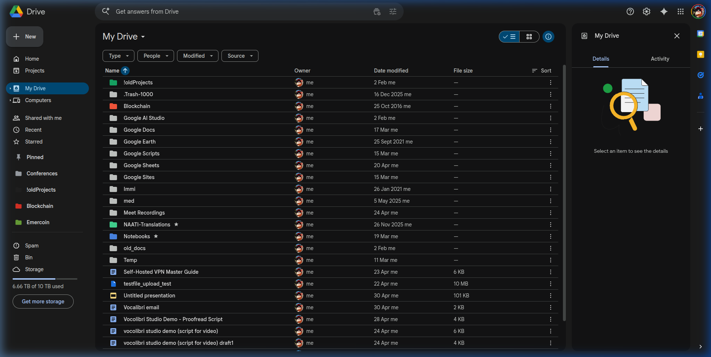

# GDrive Sidebar Pinner

GDrive Sidebar Pinner adds a native-looking **Pinned** section to the Google Drive sidebar, so frequently used folders are always one click away.



## Features

- Pin the current Google Drive folder from a floating **Pin Folder** button.
- Show pinned folders directly in the Drive sidebar below **Starred**.
- Preserve custom Google Drive folder colors in the pinned list.
- Open pinned folders in new tabs for fast multi-folder workflows.
- Sync pinned folder IDs and names through Chrome sync.
- Use only a small Manifest V3 content script, stylesheet, and `storage` permission.

## Install Locally

1. Open `chrome://extensions` or `brave://extensions`.
2. Enable **Developer mode**.
3. Click **Load unpacked**.
4. Select this project folder.
5. Open <https://drive.google.com> and navigate into a folder.

## Use

1. Open any folder in Google Drive.
2. Click **Pin Folder** in the bottom-right corner.
3. Use the new **Pinned** section in the left sidebar to reopen that folder.
4. Click **Unpin** while inside a pinned folder to remove it.

## Privacy

The extension does not collect or transmit user data. It stores pinned folder IDs and names in `chrome.storage.sync`, and stores detected folder colors locally in `chrome.storage.local`.

See [PRIVACY.md](PRIVACY.md) for the full policy.

## Build For Chrome Web Store

Run:

```bash
./scripts/package-webstore.sh
```

The upload ZIP is written to `dist/`. The package intentionally includes only:

- `manifest.json`
- `content.js`
- `styles.css`
- `icons/icon16.png`
- `icons/icon48.png`
- `icons/icon128.png`

Full publication instructions are in [docs/CHROME_WEB_STORE_RELEASE.md](docs/CHROME_WEB_STORE_RELEASE.md).

## Project Structure

```text
content.js                 Extension content script
styles.css                 Injected Google Drive UI styles
manifest.json              Manifest V3 metadata
icons/                     Extension icons and source SVG
images/                    Repository screenshots and source imagery
store_assets/              Chrome Web Store screenshots
scripts/package-webstore.sh Web Store ZIP builder
docs/                      Release and project documentation
```
