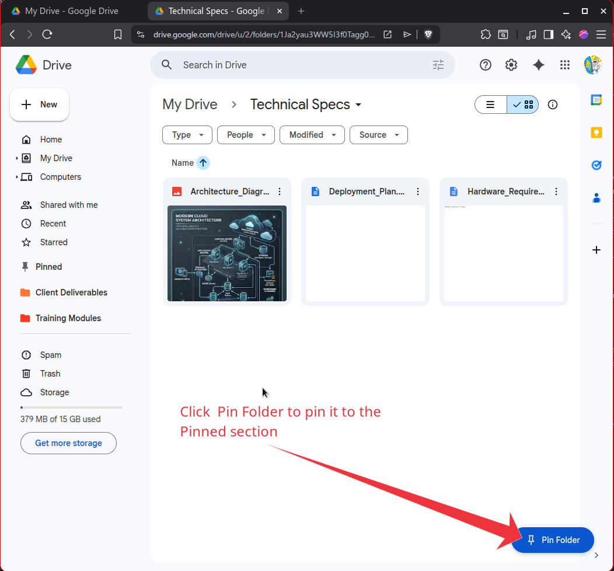
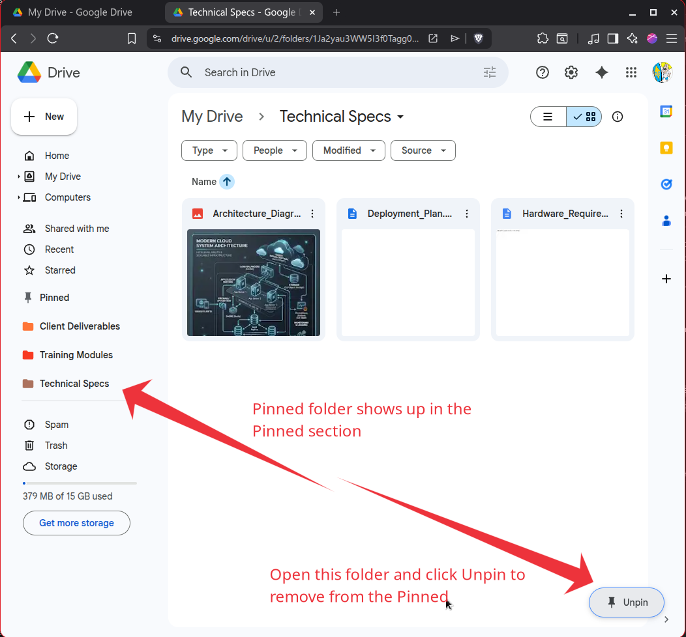
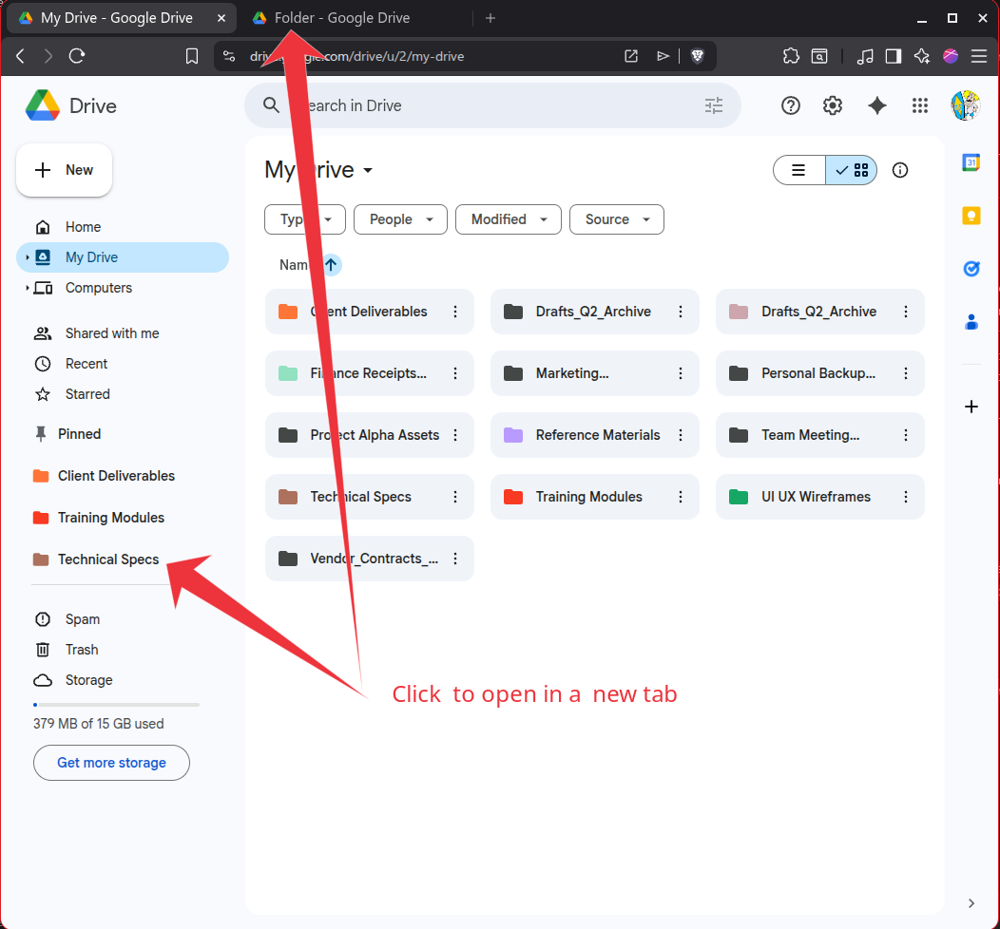

# GDrive Sidebar Pinner

GDrive Sidebar Pinner adds a native-looking **Pinned** section to the Google Drive sidebar, so frequently used folders are always one click away.

## 📺 Demo


## 📸 Walkthrough

| 1. Pin any folder | 2. Access in Sidebar | 3. Open in New Tab |
|:---:|:---:|:---:|
|  |  |  |
| *Discreet floating action* | *Native-style integration* | *Fast multi-tasking* |


## ✨ Features

- **One-Click Pinning:** Pin the current folder from a discreet floating button.
- **Native Experience:** Pinned folders appear directly in the Drive sidebar below **Starred**.
- **Color Fidelity:** Preserves your custom Google Drive folder colors in the pinned list.
- **Productivity Focused:** Open pinned folders in new tabs for fast multi-folder workflows.
- **Multi-Account Support:** (NEW) Keeps pinned folders separated per Google Drive account in the same browser profile.
- **Seamless Sync:** Syncs pinned folder IDs and names across all your Chrome devices.
- **Lightweight:** Built with Manifest V3, using minimal resources and permissions.

## 🚀 Installation

### From Chrome Web Store
*(Link to be added after publication)*

### Local Development
1. Open `chrome://extensions` or `brave://extensions`.
2. Enable **Developer mode**.
3. Click **Load unpacked**.
4. Select this project folder.
5. Open [Google Drive](https://drive.google.com) and navigate into any folder.

## 📖 Usage

1. **Pin:** Open any folder and click the **Pin Folder** button in the bottom-right.
2. **Access:** Use the new **Pinned** section in the left sidebar to jump back at any time.
3. **Unpin:** Click **Unpin** while inside a pinned folder to remove it.

## 🔒 Privacy

Your privacy is paramount. This extension:
- Does **not** collect or transmit any user data.
- Stores pinned folder metadata in `chrome.storage.sync`.
- Caches detected folder colors locally in `chrome.storage.local`.
- Uses a hashed identifier to keep pins separated between different Google accounts.

See [PRIVACY.md](PRIVACY.md) for the full policy.

## 🏗 Development

### Build For Chrome Web Store
Run the packaging script to generate a production ZIP:
```bash
./scripts/package-webstore.sh
```
The ZIP will be written to `dist/`. Full publication instructions are in [docs/CHROME_WEB_STORE_RELEASE.md](docs/CHROME_WEB_STORE_RELEASE.md).

### Project Structure
```text
content.js                 Extension logic (DOM observer & storage)
styles.css                 Native-look sidebar & button styling
manifest.json              Manifest V3 metadata
icons/                     Extension brand icons
images/                    Repository screenshots
store_assets/              Chrome Web Store marketing assets
scripts/                   Build and utility scripts
docs/                      Project documentation & release guides
```
